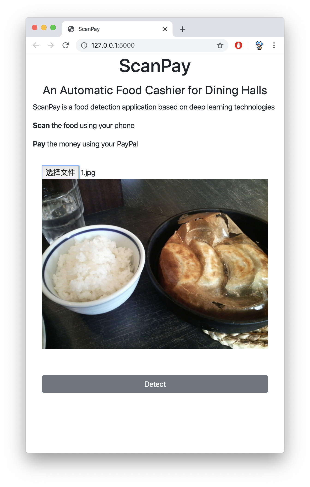
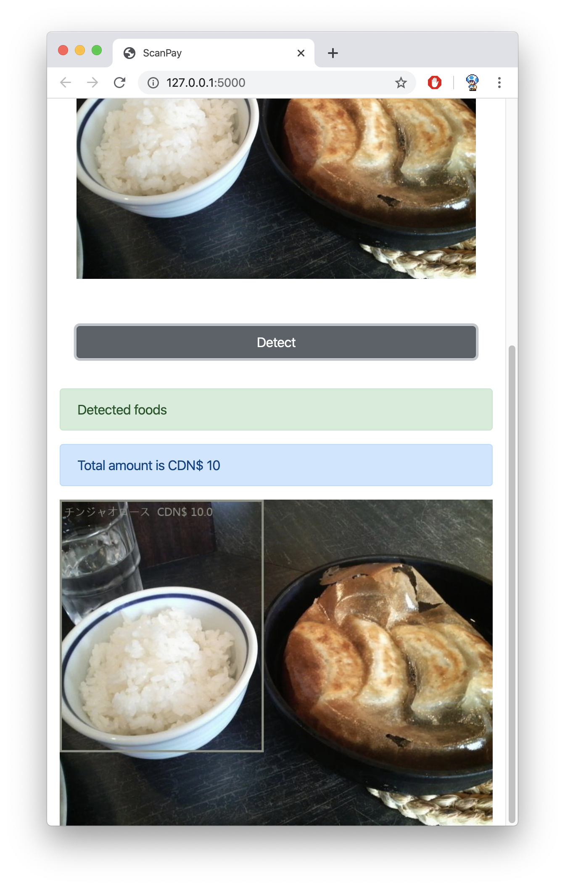

# Food Detection Using Faster R-CNN

To download the repository:

`git clone https://github.com/LiaoJunjieOfficial/ScanPay.git`

Then you need to install the basic dependencies to run the project on your system:

`
pip install -r requirements.txt
`

Then to run the Flask app:

`python -m flask run`

### Prototype




### API

URL: http://127.0.0.1:5000/ 

METHOD: POST

PARAMS:
- image: file

RESPONSE (FAIL):
```
{
    "status": "fail",
    "data": {
        "image": null,
        "amount": null
    },
}
```
RESPONSE (SUCCESS):
```
{
    "status": "success",
    "data": {
        "image": imageURL,
        "amount": amount
    },
}
```


### Experiment / Report

[Google Docs](https://docs.google.com/document/d/1Xrz1bQRj7HlFYtqOIWdIlWOK060So0lePB57yRNKV8s)


### Datasets

[Preprocessed Dataset](https://drive.google.com/file/d/101hzCMlGhmegbX-8san278gAVEds_Qit/view?usp=sharing)


### Papers

[R-CNN](https://arxiv.org/pdf/1311.2524.pdf) (Related)

[Fast R-CNN](https://arxiv.org/pdf/1504.08083.pdf) (Related)

[Faster R-CNN](https://arxiv.org/pdf/1506.01497.pdf)


### Tutorials

[Lecture on Detection](https://www.youtube.com/watch?v=nDPWywWRIRo)

[Neural Network Basics](https://pytorch.org/tutorials/beginner/deep_learning_60min_blitz.html)

[Finetune a Pre-trained Model](https://pytorch.org/tutorials/intermediate/torchvision_tutorial.html)